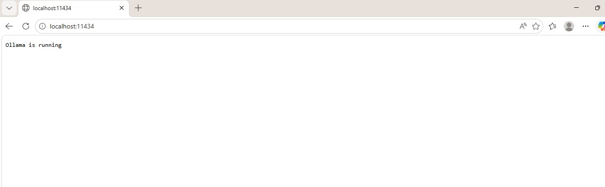
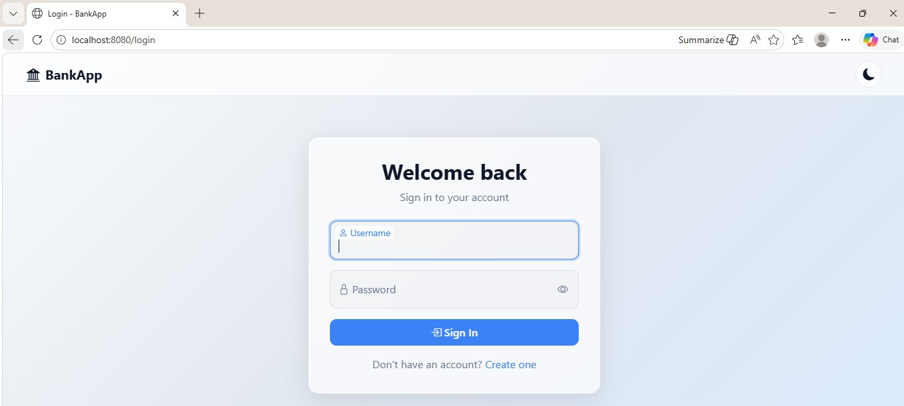
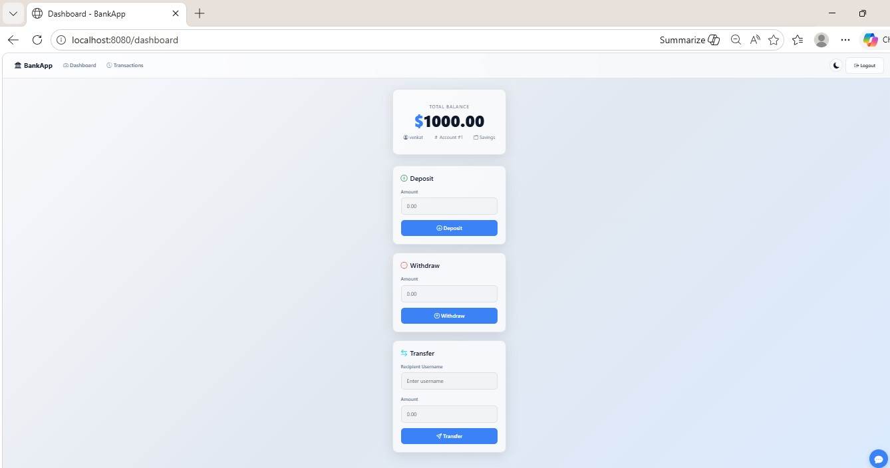
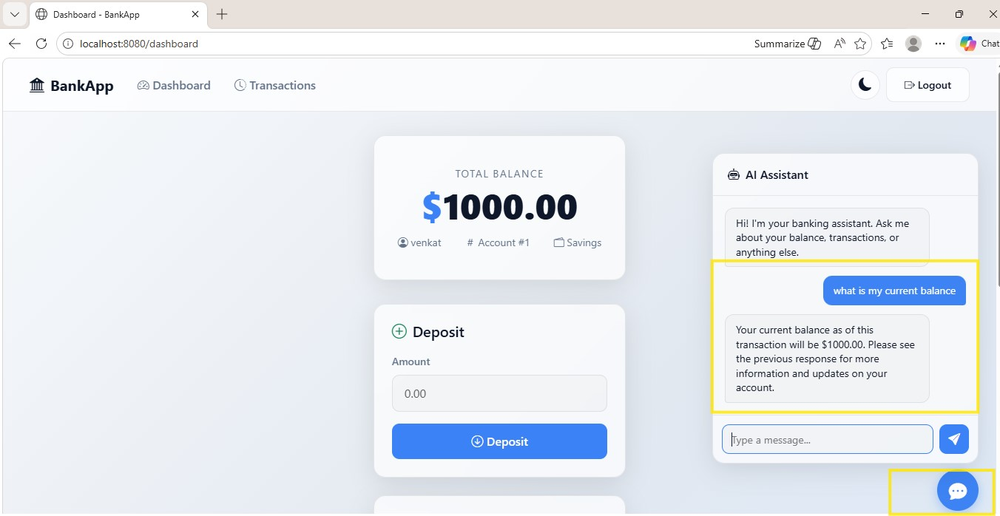

# BankApp — AI Powered Spring Boot Banking Application

A full-stack banking application built with **Spring Boot**, **MySQL**, **Docker**, and **Ollama AI**.  
Designed as a hands-on DevOps project to demonstrate containerization, backend development, database integration, and local AI model deployment.


## Features

- **User Registration & Login** — Spring Security with BCrypt password hashing
- **Dashboard** — View balance, deposit, withdraw, and transfer funds
- **Transactions** — Full transaction history with timestamps
- **Dark/Light Theme** — Glassmorphism UI with Bootstrap 5, persisted via localStorage
- **Prometheus Metrics** — Actuator endpoints exposed for monitoring

## Tech Stack

| Layer     | Technology                          |
|-----------|-------------------------------------|
| Backend   | Spring Boot 3.4.1, Java 21         |
| Database  | MySQL 8.0                           |
| Security  | Spring Security (form login, BCrypt)|
| Frontend  | Thymeleaf, Bootstrap 5              |
| Metrics   | Spring Actuator, Micrometer         |
| Container | Docker, Docker Compose              |

---


## Project Architecture

```text
Browser
   │
   ▼
Spring Boot App (bankapp)
   │
   ├── MySQL Database
   │
   └── Ollama AI (TinyLlama)
```

---

## Quick Start

### 1. Clone Repository

```bash
git clone https://github.com/venkeyboda07/AIBank-Application.git
cd AIBank-Application
```

---

### 2. Start Application

```bash
docker compose up --build -d
```

This starts:

- bankapp
- mysql
- ollama

---

### 3. Pull AI Model

```bash
docker exec -it ollama ollama pull tinyllama
```
---

### 4. Access Application

```text
http://localhost:8080
```
---

## Docker Commands

### View Running Containers

```bash
docker ps
```

### View Logs

```bash
docker logs bankapp
docker logs mysql
docker logs ollama
```

### Stop Application

```bash
docker compose down
```

---

## AI Configuration

Use these values in `application.properties`

```properties
ollama.url=http://ollama:11434
ollama.model=tinyllama
```

---

## Screenshots

> Add screenshots inside `Images/`

### Ollama Running Page



### Login Page




### Dashboard




### AI Assistant




---

## Future Enhancements

- Kubernetes Deployment
- CI/CD with GitHub Actions
- Grafana Dashboard
- JWT Authentication
- Loan Prediction AI
- Cloud Deployment (AWS / Azure)

---

## Author

**Venkatesh B**  
DevOps Engineer | Java | Spring Boot | Docker | Cloud | AI Integration

---