# BankApp — AI Powered Spring Boot Banking Application

A full-stack banking application built with **Spring Boot**, **MySQL**, **Docker**, and **Ollama AI**.  
Designed as a hands-on DevOps project to demonstrate containerization, backend development, database integration, and local AI model deployment.


## Features

- **User Registration & Login** — Spring Security with BCrypt password hashing
- **Dashboard** — View balance, deposit, withdraw, and transfer funds
- **Transactions** — Full transaction history with timestamps
- **Dark/Light Theme** — Glassmorphism UI with Bootstrap 5, persisted via localStorage
- **Prometheus Metrics** — Actuator endpoints exposed for monitoring

## Tech Stack

| Layer     | Technology                          |
|-----------|-------------------------------------|
| Backend   | Spring Boot 3.4.1, Java 21         |
| Database  | MySQL 8.0                           |
| Security  | Spring Security (form login, BCrypt)|
| Frontend  | Thymeleaf, Bootstrap 5              |
| Metrics   | Spring Actuator, Micrometer         |
| Container | Docker, Docker Compose              |

---


## Project Architecture

```text
Browser
   │
   ▼
Spring Boot App (bankapp)
   │
   ├── MySQL Database
   │
   └── Ollama AI (TinyLlama)
```
## DevSecOps CICD Project flow :
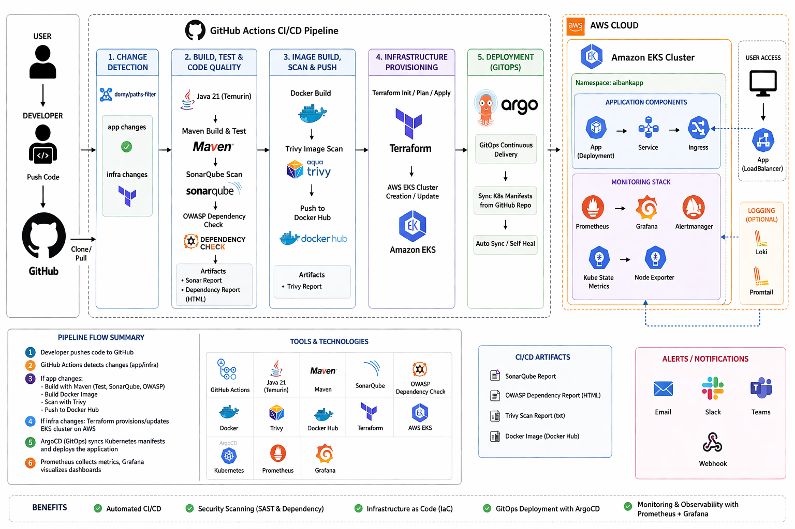
---

## Quick Start

### 1. Clone Repository

```bash
git clone https://github.com/venkeyboda07/AIBank-Application.git
cd AIBank-Application
```

---

### 2. Start Application

```bash
docker compose up --build -d
```

This starts:

- bankapp
- mysql
- ollama

---

### 3. Pull AI Model

```bash
docker exec -it ollama ollama pull tinyllama
```
---

### 4. Access Application

```text
http://localhost:8080
```
---

## Docker Commands

### View Running Containers

```bash
docker ps
```

### View Logs

```bash
docker logs bankapp
docker logs mysql
docker logs ollama
```

### Stop Application

```bash
docker compose down
```

---

## AI Configuration

Use these values in `application.properties`

```properties
ollama.url=http://ollama:11434
ollama.model=tinyllama
```

---

## Screenshots

> Add screenshots inside `Images/`

### Ollama Running Page

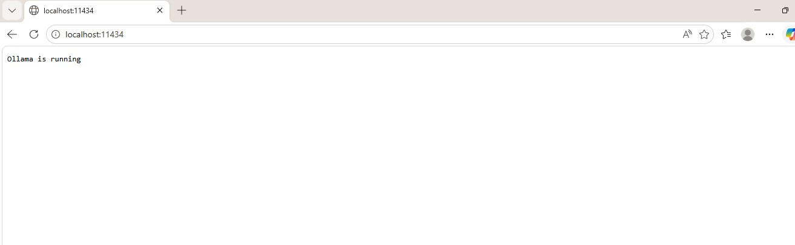

### Login Page

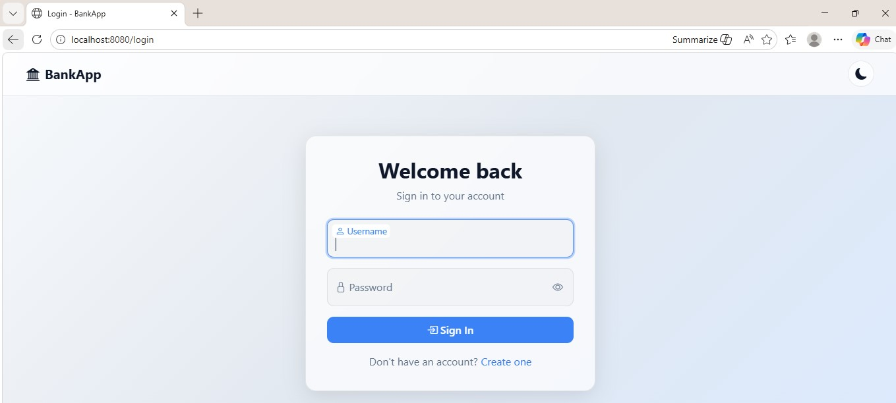


### Dashboard

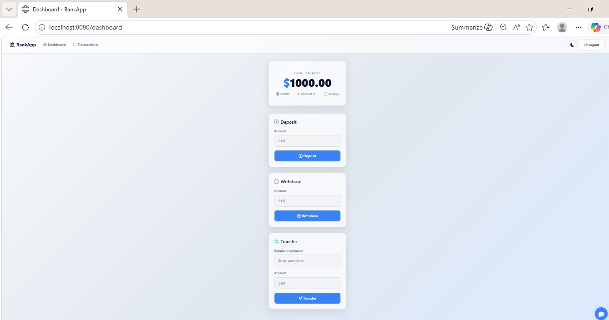


### AI Assistant

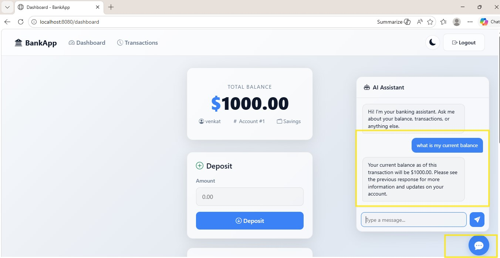
---

## Project Structure

src/main/java/com/example/bankapp/
├── config/          # Security configuration
├── controller/      # Web endpoints
├── model/           # Account & Transaction entities
├── repository/      # JPA repositories
└── service/         # Business logic

src/main/resources/
├── templates/       # Thymeleaf HTML pages
├── static/          # CSS, JS (theme toggle)
└── application.properties

## Environment Variables

| Variable         | Default    | Description          |
|------------------|------------|----------------------|
| `MYSQL_HOST`     | localhost  | Database host        |
| `MYSQL_PORT`     | 3306       | Database port        |
| `MYSQL_DATABASE` | bankappdb  | Database name        |
| `MYSQL_USER`     | root       | Database username    |
| `MYSQL_PASSWORD` | Test@123   | Database password    |

## Branch Roadmap

| Branch   | What it adds                                          |
|----------|-------------------------------------------------------|
| `start`  | Modernized app (backend + frontend)                   |
| `docker` | Dockerfile, multistage build, Compose, AI chatbot     |
| `main`   | Full DevOps pipeline (CI/CD, K8s, etc.)               |

---
## **Step 1: Create a Github actions Pipeline CI stage(bankapp.yaml)**
Inside your **GitHub repository**, create a file named `bankapp.yaml` with the following content:

```yaml
ame: AIBankApp-CI-CD

on:
  push:
    branches: [ "main" ]

jobs:

  build-maven:
    runs-on: ubuntu-latest
    
    steps:

      - name: Checkout Repository
        uses: actions/checkout@v4

  # -------------------------------
  # Setup Java
  # -------------------------------
    
      - name: Build with Maven
        uses: actions/setup-java@v4
        with:
          java-version: '21'
          distribution: 'temurin'
          cache: maven
          
 # -------------------------------
 # Build + Test + SonarQube
 # -------------------------------
      - name: Build, Test & Sonar Scan
        run: |
          mvn clean verify sonar:sonar \
          -Dspring.profiles.active=test \
          -Dsonar.projectKey=AIBankApp \
          -Dsonar.host.url=${{ secrets.SONAR_HOST_URL }} \
          -Dsonar.login=${{ secrets.SONAR_TOKEN }} \
          -Dsonar.coverage.jacoco.xmlReportPaths=target/site/jacoco/jacoco.xml
  # -------------------------------
  # Cache OWASP DB (VERY IMPORTANT)
  # -------------------------------
      - name: Cache OWASP DB
        uses: actions/cache@v4
        with:
          path: ~/.m2/repository/org/owasp/dependency-check-data
          key: owasp-db

  # -------------------------------
  # OWASP (Maven Plugin)
  # -------------------------------
      - name: OWASP Dependency Check
        run: mvn org.owasp:dependency-check-maven:check
        env:
          NVD_API_KEY: ${{ secrets.NVD_API_KEY }}

  # -------------------------------
  # Upload OWASP Report
  # -------------------------------
      - name: Upload Dependency Report
        uses: actions/upload-artifact@v4
        with:
          name: dependency-check-report
          path: target/dependency-check-report.html     

  Image-build-Scan-Push:      
    runs-on: ubuntu-latest

    env:
      DOCKER_USERNAME: ${{ secrets.DOCKER_USERNAME }}
      DOCKER_PASSWORD: ${{ secrets.DOCKER_PASSWORD }}

    steps:
      # -------------------------------
      #  Checkout Source Code
      # -------------------------------
      - name: Checkout Repository
        uses: actions/checkout@v4

      # -------------------------------
      # Trivy File System Scan
      # -------------------------------
      - name: Install Trivy
        run: |
          curl -sfL https://raw.githubusercontent.com/aquasecurity/trivy/main/contrib/install.sh | sudo sh -s -- -b /usr/local/bin
        
      # -------------------------------
      # Docker Login
      # -------------------------------
      - name: DockerHub Login
        run: echo "$DOCKER_PASSWORD" | docker login -u "$DOCKER_USERNAME" --password-stdin

      # -------------------------------
      # Build Docker Image
      # -------------------------------
      - name: Build Docker Image
        run: |
          docker build -t aibankapp .
          docker tag aibankapp:latest $DOCKER_USERNAME/aibankapp:latest
      # -------------------------------
      # Trivy Docker Image Scan
      # -------------------------------
      - name: Trivy Image Scan
        run: |
          trivy image --severity HIGH,CRITICAL --format table -o trivy-report.txt $DOCKER_USERNAME/aibankapp:latest

      # -------------------------------
      # Push Image to DockerHub
      # -------------------------------
      - name: Push Docker Image
        run: |
          docker push $DOCKER_USERNAME/aibankapp:latest
      # -------------------------------
      # upload trivy Artifacts report 
      # -------------------------------
      - name: upload report
        uses: actions/upload-artifact@v4
        with:
          name: trivy-report
          path: trivy-report.txt

```
## **Step 2: Create a github sectres for sonarqube and dockerhub credentials**
1. Go to **inside repo settings** → Click **secrets and variables** → Select **Actions**
2. Under **Actions**, choose **new repository secret or new repository variable**

```bash
       1. DOCKER_PASSWORD
       2. DOCKER_USERNAME
       3. SONAR_HOST_URL
       4. SONAR_TOKEN
       5. NVD_API_KEY
```

3. Creating VM and login ----> inside VM Installing Docker
```bash
   sudo apt-get update
   sudo apt-get install docker.io -y
   sudo usermod -aG docker $USER
   newgrp docker
```
4. After the docker installation, we create a sonarqube container (Remember to add 9000 ports in the security group).

```bash
docker run -d --name sonar -p 9000:9000 sonarqube:lts-community
```
  1. Now our sonarqube is up and Running.

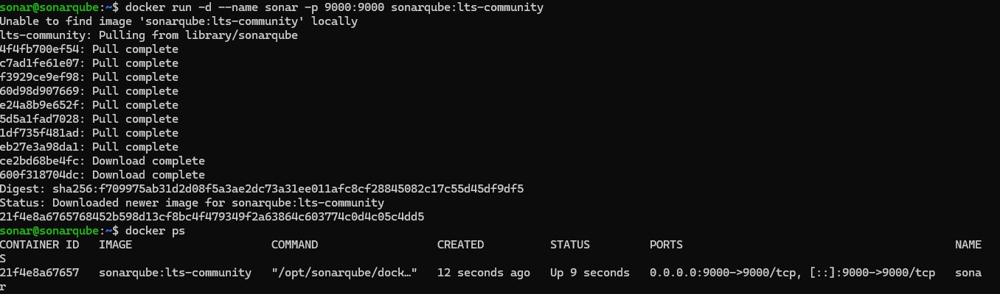

---
5. after login the sonarqube you can create token under administration ---> security
```bash
      username: admin
      password: admin
```
## **Step 3: Verify the Docker Image on Docker Hub**
Once the pipeline runs successfully:
1. Go to **Docker Hub** → Navigate to your repository
2. You should see the newly pushed Docker image 🎉
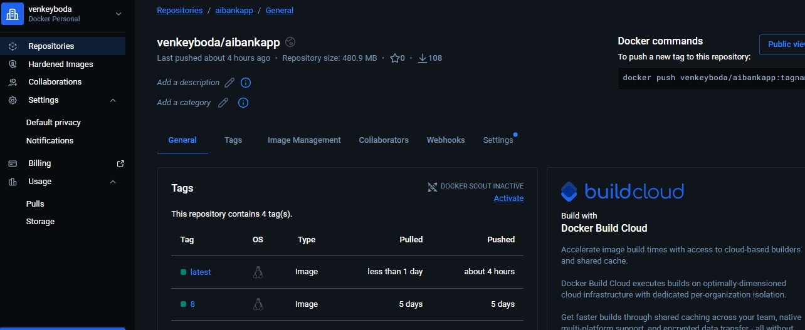

## **Bonus: Tagging the Image with Git Commit SHA**
Modify the **Push Image** stage in `bankapp.yaml` to tag images with the Git commit SHA:

```groovy
sh "docker tag ${DOCKER_IMAGE}:latest ${DOCKER_IMAGE}:${GIT_COMMIT}"
sh "docker push ${DOCKER_IMAGE}:${GIT_COMMIT}"
```
## 🔐 Security Scanning

1. The Docker image is scanned using **Trivy** identify vulnerabilities
2. Publish the trivy report **artifacts/trivy-report.xml**
    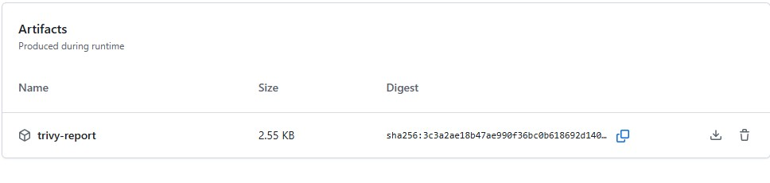

    - Scans OS packages
    - Scans application dependencies
    - Detects known CVEs
    - Ensures secure image deployment  

## **🚀 What Your CI Stage Does**

```
1️⃣ Build Docker Image

It uses the Github actions:
  - Build the Docker image
  - Tag the image as venkeyboda/aibankapp:latest

Using:
  - Docker

2️⃣ Scan Image Using Trivy

It runs a security scan using:
  - Trivy
This step:
   - Scans OS packages
   - Scans application dependencies
   - Detects known vulnerabilities (CVEs)
   - Improves container security before pushing

3️⃣ Push Image to Docker Hub

If build and scan succeed:
  - The image is pushed to Docker Hub
  - It becomes available for deployment in CD stage
```

## **Step 4: Create an Github actions CD Job (Infrastructure + Deployment)**

1. After the Docker image is successfully pushed to Docker Hub in the CI stage, we now create a CD (Continuous Deployment) stage to:

   - Provision EKS Cluster using Terraform
   - Deploy the Docker image to EKS
   - Expose the application using LoadBalancer
   - Install Prometheus & Grafana for monitoring

## **Step 4.1: Create a github sectres for aws credentials**
1. Go to **inside repo settings** → Click **secrets and variables** → Select **Actions**
2. Under **Actions**, choose **new repository secret or new repository variable**
```bash
       1. AWS_ACCESS_KEY
       2. AWS_SECRET_KEY
```       

## **Step 4.2: Update bankapp.yaml to Add CD Stage**

```yaml
# ========================= CD STAGE =========================

  # ==========================================================
  # CREATE EKS CLUSTER
  # ==========================================================
  eks-create:
    runs-on: ubuntu-latest
    steps:

      - name: Checkout Code
        uses: actions/checkout@v4

  # --------------------------------
  # Install AWS CLI
  # --------------------------------
      - name: Configure AWS Credentials
        uses: aws-actions/configure-aws-credentials@v4
        with:
          aws-access-key-id: ${{ secrets.AWS_ACCESS_KEY }}
          aws-secret-access-key: ${{ secrets.AWS_SECRET_KEY }}
          aws-region: ap-south-1

      - name: Setup Terraform
        uses: hashicorp/setup-terraform@v3

      - name: Terraform Init
        working-directory: terraform
        run: terraform init

      - name: Terraform Plan
        working-directory: terraform
        run: |
          terraform plan -out=tfplan

      - name: Terraform Apply
        working-directory: terraform
        run: terraform apply -auto-approve tfplan

  # ==========================================================
  # Deploy the application for manifest files
  # ==========================================================
  deploy-app:
    runs-on: ubuntu-latest
    steps:
      - name: Checkout Code
        uses: actions/checkout@v4

      - name: Configure AWS Credentials
        uses: aws-actions/configure-aws-credentials@v4
        with:
          aws-access-key-id: ${{ secrets.AWS_ACCESS_KEY }}
          aws-secret-access-key: ${{ secrets.AWS_SECRET_KEY }}
          aws-region: ap-south-1

      - name: Update kubeconfig
        run: aws eks update-kubeconfig --name bankapp_aws-cluster --region ap-south-1

      - name: Deploy App
        run: |
         kubectl apply -f kubernetes/namespace.yaml
         sleep 30s
         kubectl apply -f kubernetes/
         
```
## **step 4.3: Check the EKS deployment succussfull or not**

1. first pull the image 
2. created EKS cluster 
3. deploy the application

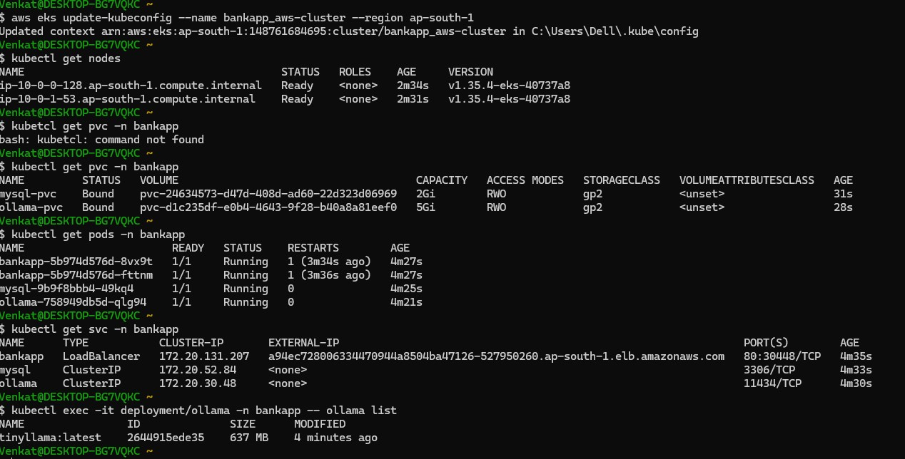

### To see whether the container is running or Not

  1. Go to web-browser and type `http://$EXTERNAL_IP"`
  2. Youll be directed to the Website as follows

#### creating account Page

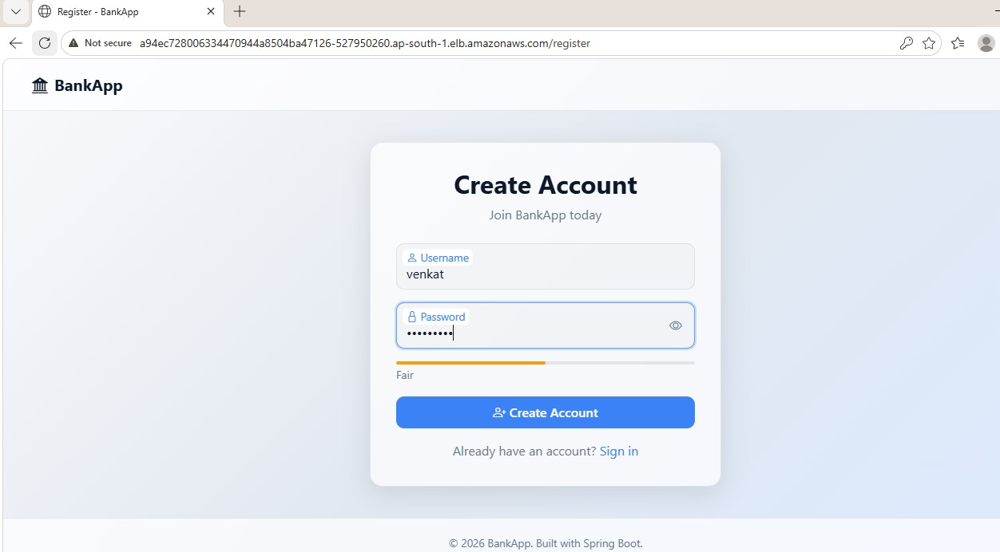

#### Login Page

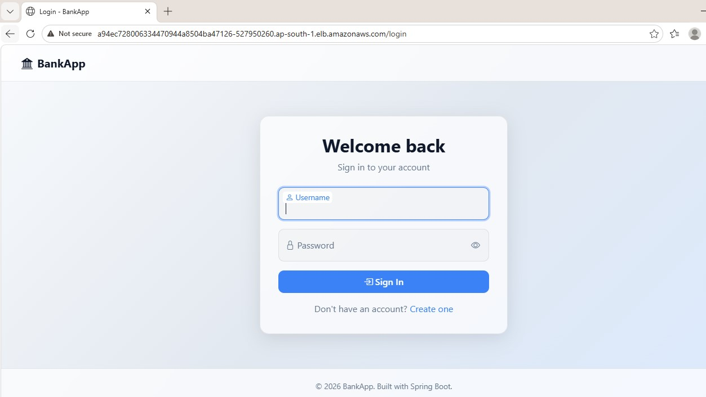

#### Dashboard

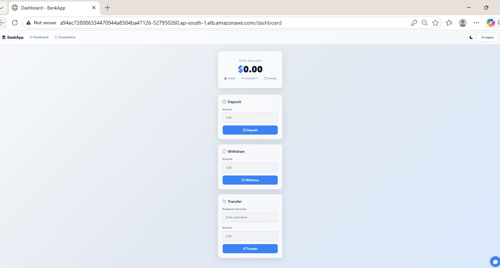

#### Transaction History

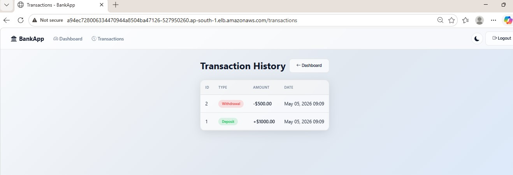

### AI Assistant

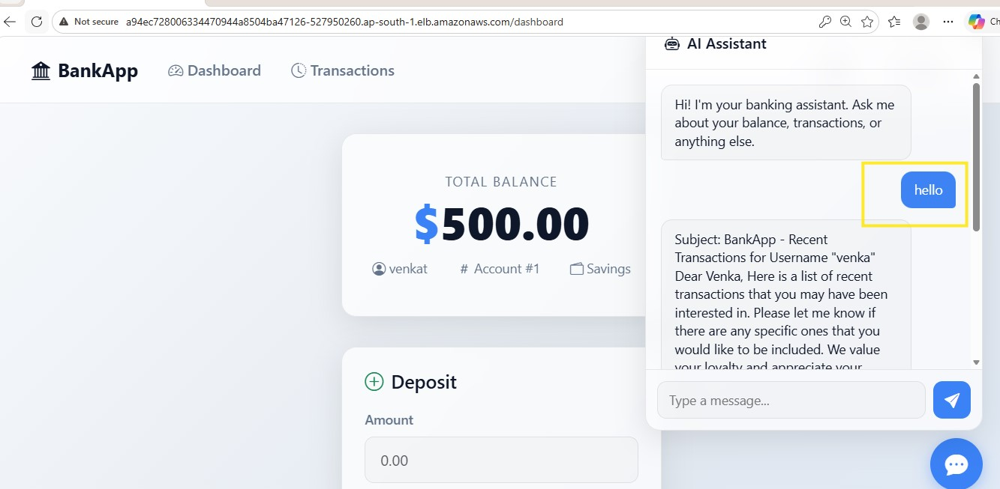
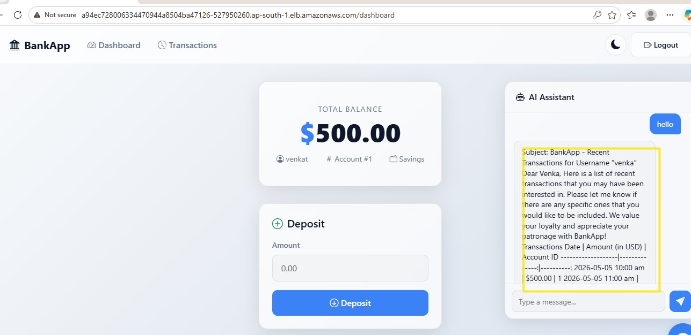
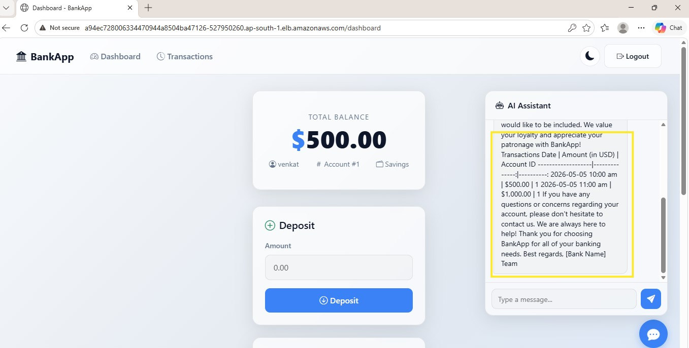

## **step 5 — Installing GitOps (Argo CD)**

```bash
kubectl create namespace argocd
kubectl apply -n argocd \
https://raw.githubusercontent.com/argoproj/argo-cd/stable/manifests/install.yaml
```

 1. Access UI:

```bash
kubectl patch svc argocd-server -n argocd \
  -p '{"spec": {"type": "LoadBalancer"}}'
```
2. Getting argocd credentials
   
```bash
   ## default username: 
     admin
   ## getting password
   kubectl get secret argocd-initial-admin-secret -n argocd \
-o jsonpath="{.data.password}" | base64 -d
```
### Argocd dashboard screenshots

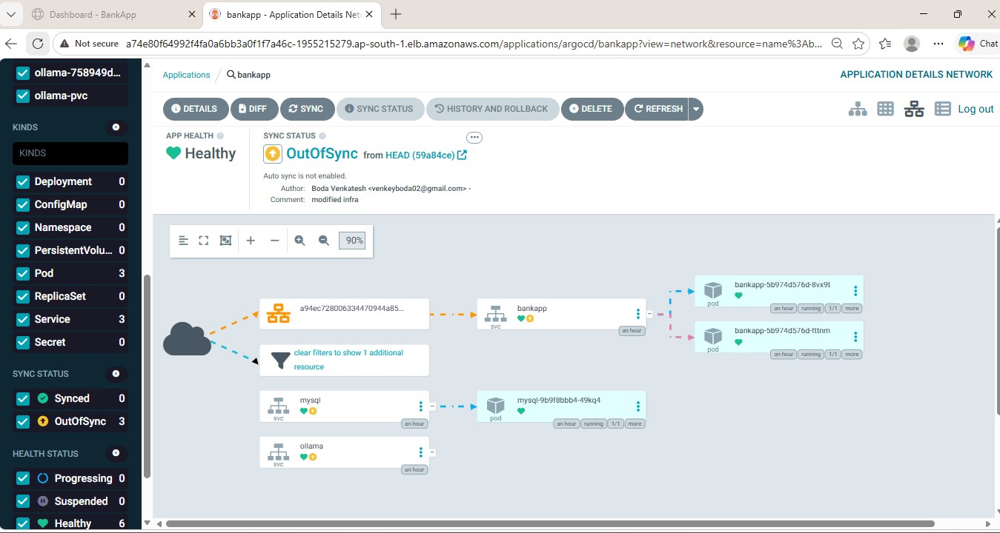

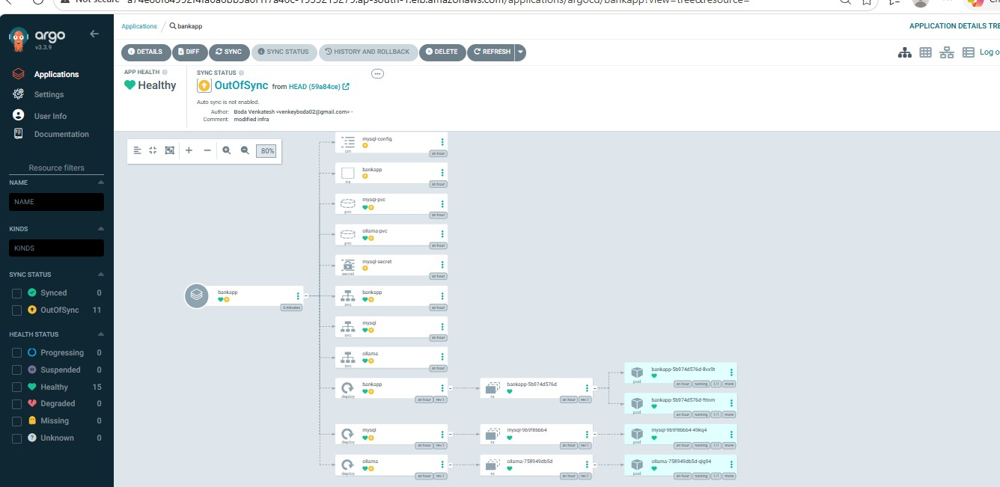


## **step 6 — Install Monitoring Stack**

### Install Prometheus + Grafana

```bash
helm repo add prometheus-community https://prometheus-community.github.io/helm-charts
helm repo update

helm install monitoring prometheus-community/kube-prometheus-stack \
  --namespace monitoring --create-namespace
```
## Access Grafana

```bash
kubectl patch svc monitoring-grafana -n monitoring \
  -p '{"spec": {"type": "LoadBalancer"}}'
```
```bash
kubectl get svc -n monitoring
    # Expose via LoadBalancer (EKS)
👉http://<EXTERNAL-IP>
```
Getting Grafana credentials
   
```bash
   ## default username: 
     admin
   ## getting password
kubectl get secret monitoring-grafana -n monitoring \
-o jsonpath="{.data.admin-password}" | base64 -d
```
### Grafana dashboard screenshots

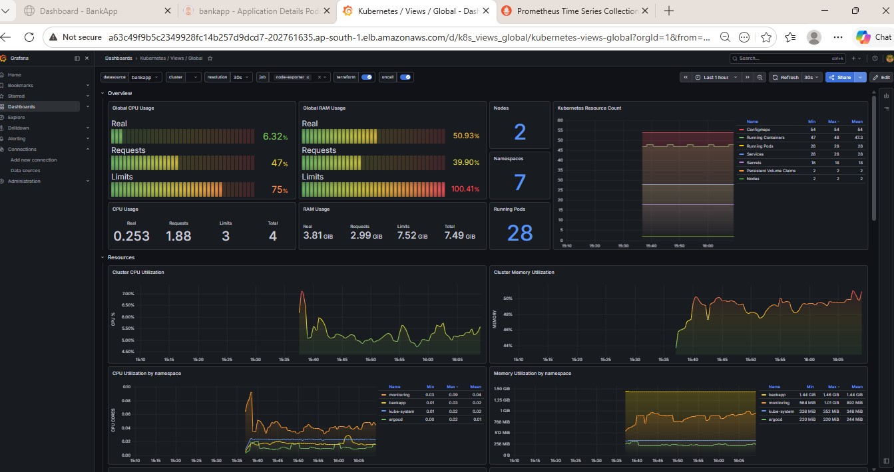

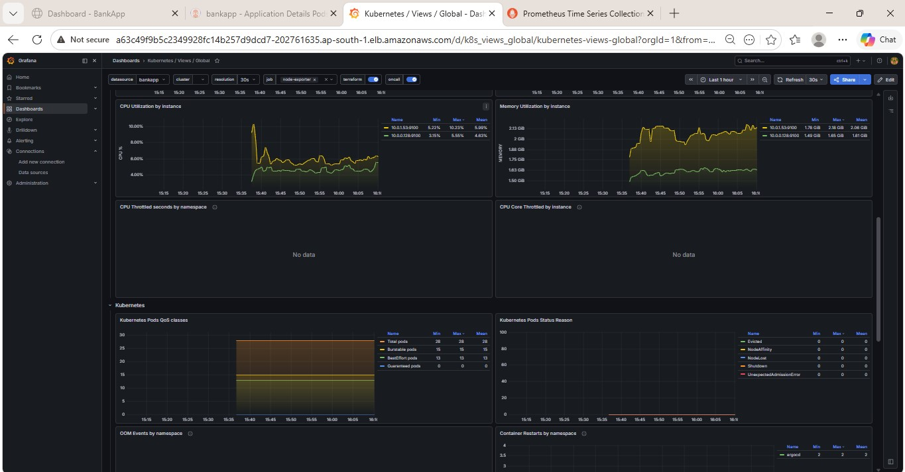

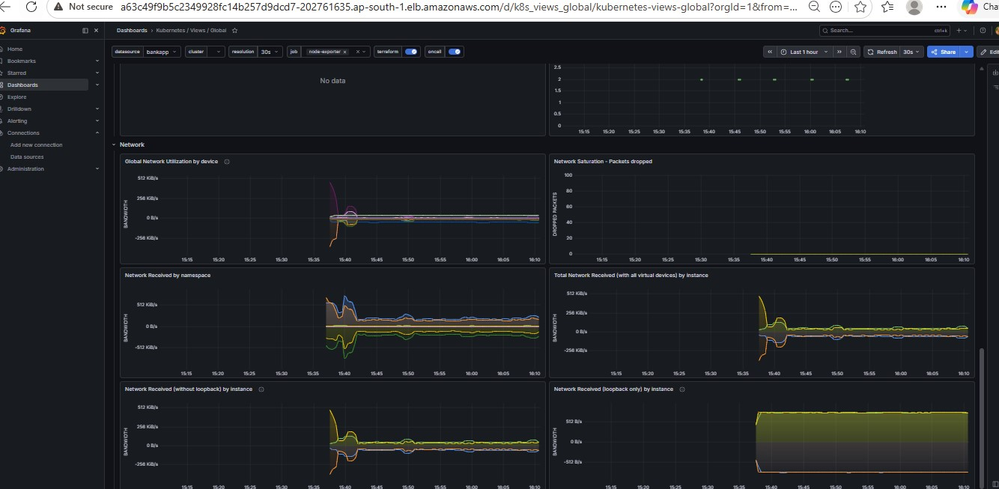


## **Step 7: What This CD Stage Does**

```
1️⃣ Provision Infrastructure

 ### Uses Terraform to create:
  - EKS Cluster
  - Node Pool

### Technology used:
  - Terraform
  - Elastic Kubernetes Service

2️⃣ Deploy Application to EKS

  - Fetch EKS credentials
  - Apply Kubernetes manifests
  - Pull Docker image from Docker Hub
  - Create LoadBalancer service

### Technology used:

   - Docker
   - Kubernetes

3️⃣ Install Monitoring Stack

### Installs monitoring using Helm:

   - Prometheus
   - Grafana
```

## **Conclusion**
This project demonstrates how to automate Docker image **builds and pushes** using **Github Actions pipelines**, improving **DevOps workflows**! 🚀

## Contribution and Usage
    - If you want to contribute: open an issue or PR describing the change.
    - If you want to fork or reuse: follow the license (see below).
    - If you want to customize deployment: adjust the Terraform configs in Infra/  and Kubernetes manifests in kubernetes/.

📄 License
This project is licensed under the MIT License. See the LICENSE file for details.
MIT License [web:1][web:6]

text

***

### How to place this in your repo

1. In your repo root, create or edit: `README.md`  
2. Paste the above content.  
3. Replace placeholder text (tech stack, repo name, license file path, etc.) with your actual values.

## Author

**Boda Venkatesh**  
DevOps Engineer | Java | Spring Boot | Docker | Cloud | AI Integration

---